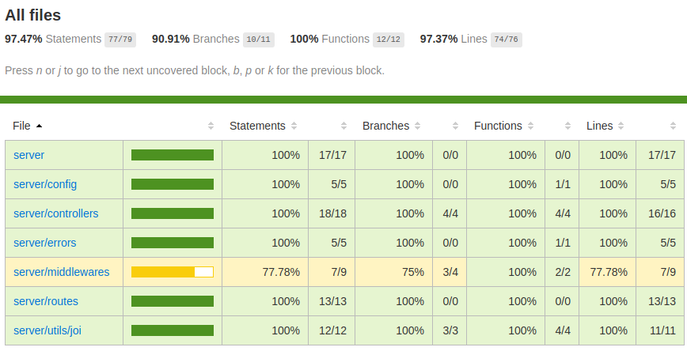

# POC - Worker Threads no Node.js
O objetivo desse projeto é realizar a prova de conceito das [Worker Threads](https://nodejs.org/api/worker_threads.html)
do Node.js, que obteve sua versão estável a partir do Node 12.

O Node.js possui 

## Pré-requisitos
* [Node.js](https://nodejs.org/en/) (Versão 12 ou superior)
* [NPM](https://npmjs.com)
* [Docker](https://www.docker.com/get-started)
* [Docker-compose](https://docs.docker.com/compose/install/)

## Iniciando o projeto

### Iniciando o projeto em container

Para executar a aplicação em container, basta executar o comando abaixo e deixar a mágica acontecer:
```
npm run start:container
```

Após isso, basta seguir os passos em [Usando a API](#usando-a-api)

### Iniciando o ambiente de dev
1. Instale as dependências do projeto
```
npm install
```
2. Copie e cole o arquivo .env.example e renomeie para .env
```
cp .env.example .env 
```
3. Execute o script dev para subir a aplicação
```
npm run dev
```

Após isso, basta seguir os passos em [Usando a API](#usando-a-api)

## Usando a API

### Acessando a documentação

Estamos utilizando o [Swagger](https://swagger.io) para nos auxiliar com a documentação da API seguindo a OpenAPI Specification.
Com o projeto rodando na porta `3000`, basta acessar o endereço http://localhost:3000/api-docs para visualizar a documentação com a interface do Swagger.

Caso preferir, segue um exemplo de requisição via cUrl:
```
curl --request GET \
  --url 'http://localhost:3000/api/fibonacci/without-threads'
```

### Requisições sem o uso de threads

## Testes

### Executando os testes

Estamos utilizando o [Mocha.js](https://mochajs.org) como framework de testes, juntamente com o [supertest](https://www.npmjs.com/package/supertest) para simular as requisições nos testes de integração, o [chai](https://www.chaijs.com) para nos ajudar com as asserções e o [nyc](http://npmjs.com/package/nyc) para cuidar da cobertura de código.

Para executar os testes, é necessário:

1. Instalar as dependências:
```
npm install
```
2. Iniciar os testes:
```
npm test
```

Após isso, é possível visualizar o percentual de cobertura do código e analisar linha a linha. Para isso, basta abrir no navegador o arquivo `PROJECT_DIR/coverage/index.html`. Será possível navegar em telas semelhante à essas:




